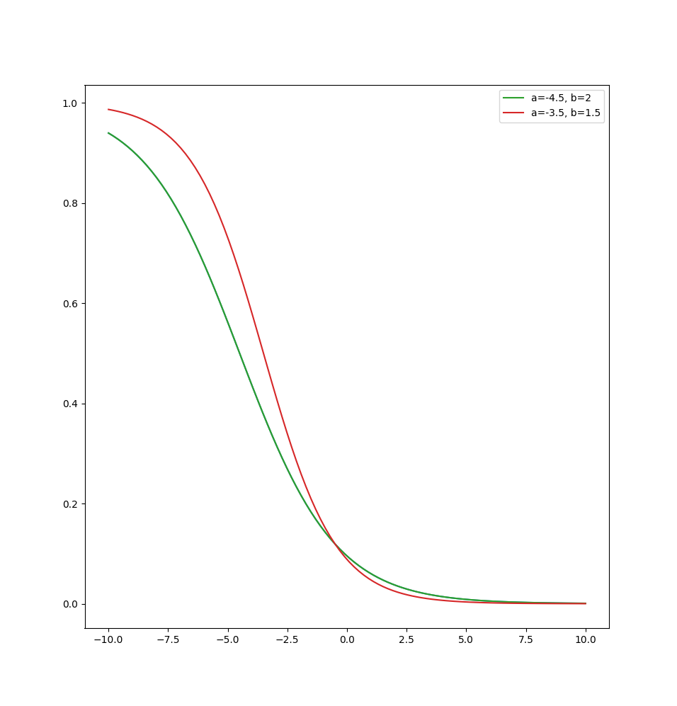

# IC Great Exhibition Road Festival
## Experimental report - Day 1 (18.06.2022)

Unless otherwise stated, the parameters in the `camera` software package running on the Observer are:

- using correction for double counted redundant atoms (i.e. `use_correction = True`)
- average observations (i.e. `use_local = False`)
- observation window of 10 seconds (`observation_window_size = 120`)
- 15 seconds at the beginning of each experiment to gather trajectories before $\Psi$ starts being computed (`sample_threshold = 180`)
- during these initial 15 seconds, a constant value is used $\Psi_0 = -5$
- median filter smoothing over 3 seconds (i.e. `psi_buffer_size = 36`)
- the $\Psi$ value is converted into a synchrony random parameter (0 for max synchrony, 1 for max randomness) with a 'reversed logistic' function

    $$f(\Psi, a, b) = \frac{1}{1+e^{\frac{\Psi - a}{b}}}$$

- we begin with $a=0, b=3$, which, with $\theta = 0.02$, requires $\Psi \ge 13$ to win the game

As the function tends to 0 as $\Psi$ grows, we need to set a threshold $\theta$ of how close to 0 the value needs to be to trigger the rainbow winning loop.

Parameters of the `leds` software package running on the Player hats:

- interval (in seconds) lights are on: `on_delay = 0.5`
- interval (in seconds) lights are off when there is no randomness: `off_delay = 1.5`
- winning threshold $\theta$ (in seconds): `threshold = 0.02`

N.B.:

- *Start time* refers to the beginning of recording/initialising Emergence calculator.
- *End time* refers to the end of recording, when the server is shut down and tracking stops.
- *Psi duration* refers to an approximate number of frames since the game begins until they emerge, or the game ends. Note this includes the initial 15 seconds.

\clearpage

## Group A1
- Start: 12:22:43
- End: 13:05:37
- Video: `output_22-06-18_1222.avi`
- $\Psi$ duration: 337 frames
- Manual: NO
- Emerged: YES

Emerged very quickly, in less than a minute, behaviour looks flock-like and not redundant. $\Psi$ spiked up to 48. Likely this was caused by using local observations, which causes very high variance fluctuations in $\Psi$.

Params:

- `use_local = True`

\clearpage

## Group A2
- Start: 13:05:56
- End: 13:13:43
- Video: `output_22-06-18_1305.avi`
- $\Psi$ duration: 2918 frames
- Manual: YES, at 13:12:47
- Emerged: NO

From this point onwards we changed to average observations (i.e. `use_local = False`) which causes the $\Psi$ to have a slower rate of growth. This gives a more balanced difficulty to the game. As we were not sure the people will ever win, with $\Psi$ being low even with the circle configuration, we decided to 'induce' the impression of winning by triggering it manually.

\clearpage

## Group A3
- Start: 14:13:21
- End: 14:14:52
- Video: `output_22-06-18_1413.avi`
- $\Psi$ duration: 575 frames (more frames were recorded after winning the game, ignoring as tracker did not work)
- Manual: NO
- Emerged: YES

Params:

- `a=-6, b=1.5` which, with $\theta = 0.02$, requires $\Psi \ge 1$ to win the game

The group went into a circular configuration and maintained it to win the game. The function $a$ param likely made the 'winning $\Psi$' too low.

\clearpage

## Group A4
- Start: 14:35:11
- End: 14:37:45
- Video: `output_22-06-18_1435.avi`
- $\Psi$ duration: 794 frames
- Manual: NO
- Emerged: YES

Params:

- `a=-6, b=1.5` which, with $\theta = 0.02$, requires $\Psi \ge 1$ to win the game

The group moved chaotically, but maintaining somewhat coherent direction. Seems to have emerged as they were aggregating together. Difficulty was also too low for this game due to the $a, b$ parameters.

\clearpage

## Group A5
- Start: 15:06:41
- End: 15:12:46
- Video: `output_22-06-18_1506.avi`
- $\Psi$ duration: 2204
- Manual: YES, at 15:12:09
- Emerged: NO

Params:

- `a=-3.5, b=1.5` which, with $\theta = 0.02$, requires $\Psi \ge 333$ to win the game
- `psi_buffer_size = 60`

One of the most interesting groups, they communicated non-verbally through signs, and tried multiple strategies, such as splitting in two groups, and going in opposite directions, aggregating together and moving together accross the play area. They also tried walking in a line from a side of the play area to another.

\clearpage

## Group A6
- Start: 16:08:32
- End: 16:18:37
- Video: `output_22-06-18_1608.avi`
- $\Psi$ duration: 2348
- Manual:NO
- Emerged: YES

Params:

- `a=-4.5, b=2` which, with $\theta = 0.03$, requires $\Psi \ge 3.3$ to win the game
- `psi_buffer_size = 60`

Likely because of the thresholds set on the hats, the rainbow loop did not trigger, albeit the group was acting in sync and $\Psi > 3$. We set the manual toggle to trigger the winning loop at 16:14:39.

For the purpose of analysis we shall consider this group to NOT have manual intervention as the group _did_ emerge.

After this point, the threshold on the hats was increased from 0.02 to 0.03 (i.e. when randomness is less than 0.03, you have won the game).

\clearpage

## Group A7 - errors in system
- Start: 16:49:32, 16:52:09
- Video: `output_22-06-18_1649.avi`, `output_22-06-18_1652.avi`

The system immediately emerged (showing the rainbow) without the group behaving in an emergent way. Made two attempts trying to sort out the code. To discard.

## Group A8
- Start: 17:13:11
- End: 17:28:56
- Video: `output_22-06-18_1713.avi`
- $\Psi$ duration: 3753 frames
- Manual: NO
- Emerged: NO

Params:

- `a=-4.5, b=2`
- `psi_buffer_size = 60`

In this group, a small child broke a hat and caused issues with tracking, so we had to stop early, before they could emerge. Nonetheless the group was interesting, also communicating with gestures, and they gathered together in a circle leaning back and forth.

\clearpage

## Group A9
- Start: 17:52:55
- End: 18:02:00
- Video: `output_22-06-18_1752.avi`
- $\Psi$ duration: 4141 frames
- Manual: NO
- Emerged: NO

Params:

- `a=-4.5, b=2`
- `psi_buffer_size = 60`

This group did not behave very emergently, but also there were two people who wore their hats on the back of their heads, causing tracking issues. There were Kalman filter predictions in the tracker that didn't correspond to actual positions, which may have also caused lack of emergence.

Didn't stop recording so the video is much longer than the experience, which was about 10 min.

\clearpage

## BONUS: Group A10 - experimenters
- Start: 18:30:45
- End: 18:02:00
- Video: `output_22-06-18_1830.avi`
- $\Psi$ duration: 1140 frames
- Manual: NO
- Emerged: YES

Params:

- `a=-4.5, b=2`
- `psi_buffer_size = 60`

\clearpage

## A note on the mapping between emegence $\Psi$ and blinking randomness $r$

There are two considerations here: the steepness of the curve will suggest how fast the feedback is, by establishing the mapping between $\Psi$ and the randomness parameter $r$, used by hats to decide the delay in blinking. The curve should not be too steep but also it should allow $r \rightarrow 0$ as $\Psi$ grows.

We have decided that $\Psi \approx 3$ is large enough, producing $r(3) = f(3, -4.5, 2) = 0.022$, which, multiplied with the maximum delay (in seconds) between blinks, currently 1.5s, gives a max random delay of 0.034. From running the experiments today, it has become clear that delays of 0.02-0.03 seconds are not perceived by players, causing a 10-20 second period in which they believe they have won before the parameter gets small enough.

Therefore in future experiments, the threshold $\theta$ is chosen with respect to human perception, assuming that a delay smaller than 0.04 seconds is difficult to perceive as lack of synchrony, we set $\theta = 0.04$.

