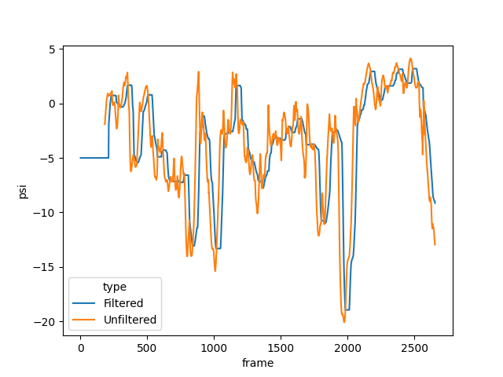

# IC Great Exhibition Road Festival
## Experimental report - Day 2 (19.06.2022)

Unless otherwise stated, the parameters in the `camera` software package running on the Observer are:

- recording at 12fps
- using correction for double counted redundant atoms (i.e. `use_correction = True`)
- average observations (i.e. `use_local = False`)
- observation window of 10 seconds (`observation_window_size = 120`)
- 15 seconds at the beginning of each experiment to gather trajectories before $\Psi$ starts being computed (`sample_threshold = 180`)
- during these initial 15 seconds, a constant value is used $\Psi_0 = -5$
- median filter smoothing over 5 seconds (i.e. `psi_buffer_size = 60`)
- the $\Psi$ value is converted into a synchrony random parameter (0 for max synchrony, 1 for max randomness) with a 'reversed logistic' function

    $$f(\Psi, a, b) = \frac{1}{1+e^{\frac{\Psi - a}{b}}}$$

- we begin with $a=-3.5, b=2$, which, with $\theta = 0.035$, requires $\Psi \ge 2.97$ to win the game

As the function tends to 0 as $\Psi$ grows, we need to set a threshold $\theta$ of how close to 0 the value needs to be to trigger the rainbow winning loop.

Parameters of the `leds` software package running on the Player hats:

- interval (in seconds) lights are on: `on_delay = 0.5`
- interval (in seconds) lights are off when there is no randomness: `off_delay = 1.5`
- winning threshold $\theta$ (in seconds): `threshold = 0.04`

N.B.:

- *Start time* refers to the beginning of recording/initialising Emergence calculator.
- *End time* refers to the end of recording, when the server is shut down and tracking stops.
- *Video duration* refers to the length of the recorded video. This has been recorded at 24fps as opposed to 12 so the video is around twice as short than the interval between start and end time.
- *Psi duration* refers to an approximate number of frames since the game begins until they emerge, or the game ends, which is when either the recording stops, or tracking finds less than 8-9 objects, which indicates that players either start leaving the stage, or the rainbow is enabled. This includes the initial 15 seconds.

\clearpage

## Group 1
- Start: 12:14:22
- End: 12:20:48
- Video: `output_22-06-19_2214.avi`
- Video Duration: 00:03:36.83
- Psi Duration (frames): 2524
- Manual psi: NO
- Emerged: YES
- Max Psi: 3.179
- Max Psi time index (frames):

The group formed a circle which was reducing in diameter, and then two players started circling the opposite direction. They returned to the circle moving in the same direction towards the end.

N.B.: The date was broken on observer, the hour was set to 22, so some files may use timestamp `221422`.

N.B.: There was a slight delay between them emerging and the hats going rainbow. Upon investigation, it appeared we were expecting a value of 2.5 to win when hats were expecting 2.97. See below

- 26 blinks = 52s between $\Psi$ = 2.5
- Max Psi time index (frames): 2167 and rainbow loop
- $\Psi$ spikes above 2.5 three times:

    - 2167-2204 and reaches as high as 2.937
    - 2364-2426 and reaches as high as 3.133 with $Psi \ge 2.97$
- Max Psi time index (frames): 2413
    - 2481-2524 and reaches as high as 3.179

## Group 2
- Start: 13:00:33
- End:   13:11:27
- Video: `output_22-06-19_1300.avi`
- Video duration: 00:06:12.17
- Psi Duration (frames): 1072
- Manual psi: NO
- Emerged: NO
- Max Psi: 1.86

A participant came in with a pram with a baby who was crying throughout the game, causing distress in the group. Players repeatedly stopped to tend to the baby or left player area. 

Repeated reports of frustration.
In spite of that, there have been a few instances of coherent motion, especially the circle configuration, albeit it was too spread out to be emergent enough. In general the group was quite spreadh out.

\clearpage

## Group 3
- Start: 13:29:42
- End:   13:34:50
- Video: `output_22-06-19_1329.avi`
- Video duration: 00:02:51.83
- Psi Duration (frames): 2028
- Manual psi: NO
- Emerged: YES
- Max Psi: 3.341
- Max Psi time index (frames): 1884

4 children in this group, one of them small.
Matt Davis - Cambridge neuroscientist - was in the group.

Similar strategy to group 1, coming closer and closer together in a circle, with 1-2 players inducing randomness.
Learned very quickly, started very disorganised and then self-organised.

\clearpage

## Group 4
- Start: 14:01:48
- End:   14:12:37
- Video: `output_22-06-19_1401.avi`
- Video duration: 00:06:12.42
- Psi Duration (frames): 4489
- Manual Psi: NO
- Emerged: NO
- Max Psi: 1.413
- Max Psi time index (frames): 4208

Players mostly moved chaotically and were sparsely spread in the space. They only gathered together towards the end, a tightening circle configuration.
Max value achieved <1.5 and was not sustained, decreasing immediately.

\clearpage

## Group 5
- Start: 15:09:07
- End:   15:19:28
- Video: `output_22-06-19_1509.avi`
- Video duration: 00:05:35.67
- Psi Duration (frames): 4029
- Manual Psi: NO
- Emerged: NO

Negative emergence values throughout gameplay, as small as -27.
In the beginning, 1-2 players separated from the group, appearing to observe the game. This repeats through the first half.
Towards the end were walking in a line, back and forth. This strategy has also been used in Day 1 but this group had too much redundancy, with movements being almost the same.
Subjectively, they didn't really seem to act as a group, more like smaller groups occasionally working together.

N.B.: Two people wore their hats wrong, could affect computations of emergence criterion.

\clearpage

## Group 6
- Start: 15:33:40
- End:  15:42:01
- Video:  `output_22-06-19_1533.avi`
- Video duration: 00:04:37.33
- Psi Duration (frames): 2711
- Manual Psi: NO
- Emerged:  YES
- Max Psi: 3.77
- Max Psi time index (frames): 2574

Group moved chaotically in the beginning but learned how to come together.
Sometimes used gestures to communicate.
Walking back and forth at first, somewhat flock-like, then become disorganised.
Mid-game one player separated from the group, appearing to observe.
Finally they aggregated and then formed and maintained a circle, which was spread out and regular, then slowly tightened until they won.

N.B.: Video runs for > 1min after people stop playing (at 15:40:34).

N.B: There was an issue with Player 7 being delayed caused by the hat running out of battery and the undervolted CPU being delayed in keeping time.

N.B.: This group did not fill the free-form questions.

\clearpage

## Group 7
- Start: 16:02:04
- End:   16:05:41
- Video: `output_22-06-19_1602.avi`
- Video duration: 00:02:03.83
- Psi Duration (frames): 1426
- Manual Psi: NO
- Emerged: YES
- Max Psi: 4.174
- Max Psi time index (frames): 1287

First one person separated from the group, then they aggregated quickly into a tigher group and then a cirlce. Sometimes used signs to communicate.

At 1:34 in the video they change direction of their circle spinning, which increaeed emergence much quicker than everything they did before.

N.B.: Send them the video when you get contacted!

\clearpage

## Group 8
- Start: 16:43:03
- End: 16:53:45
- Video: `output_22-06-19_1643.avi`
- Video duration: 00:06:02.08
- Psi Duration (frames): 4368
- Manual Psi: NO
- Emerged: NO
- Max Psi: 1.555
- Max Psi time index (frames): 3486

Sometimes acted like they were two groups exploring eachother. Occasionally 1-2 people separate from the group and stop or act in the opposite way.

\clearpage

## Group 9
- Start: 17:16:56
- End:   17:23:45
- Video: `output_22-06-19_1716.avi`
- Video duration: 00:03:41.67
- Psi Duration (frames): 2599
- Manual Psi: NO
- Emerged: YES
- Max Psi: 3.533
- Max Psi time index (frames): 2521.

Tried multiple strategies - walking in lines, figure of 8, circle. At times they stopped moving to plan. Lots of communication.

\clearpage

## Group 10
- Start: 17:48:00
- End: 17:56:06
- Video: TODO:
- Video duration: TODO:
- Psi Duration (frames): 3324
- Manual Psi: NO
- Emerged: YES
- Max Psi: 2.784
- Max Psi time index (frames): 3293.

\clearpage

# General oservations:

- When groups reach a peak of psi > 1.5 they stay at that value for at least a second
-

